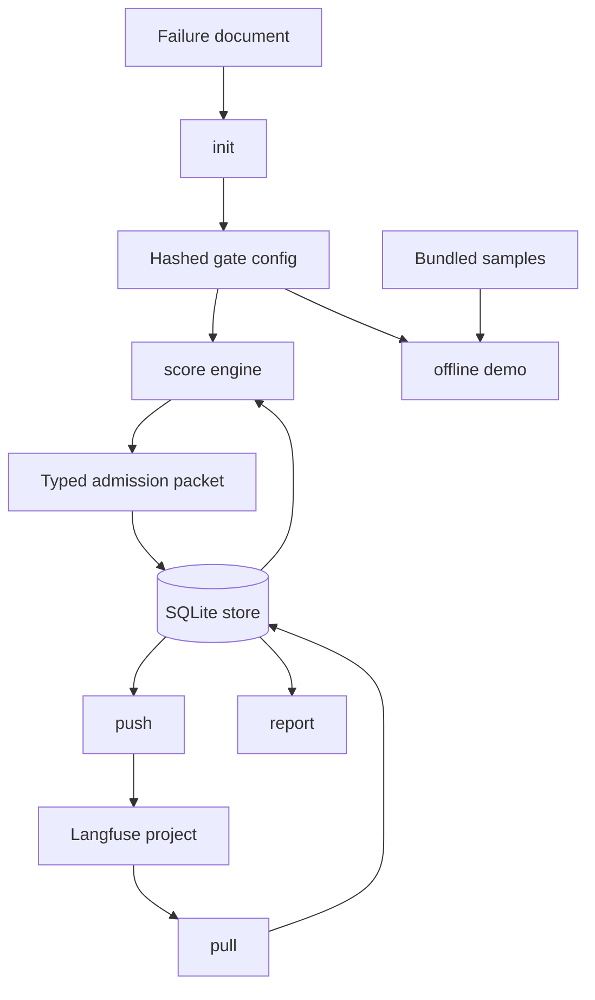
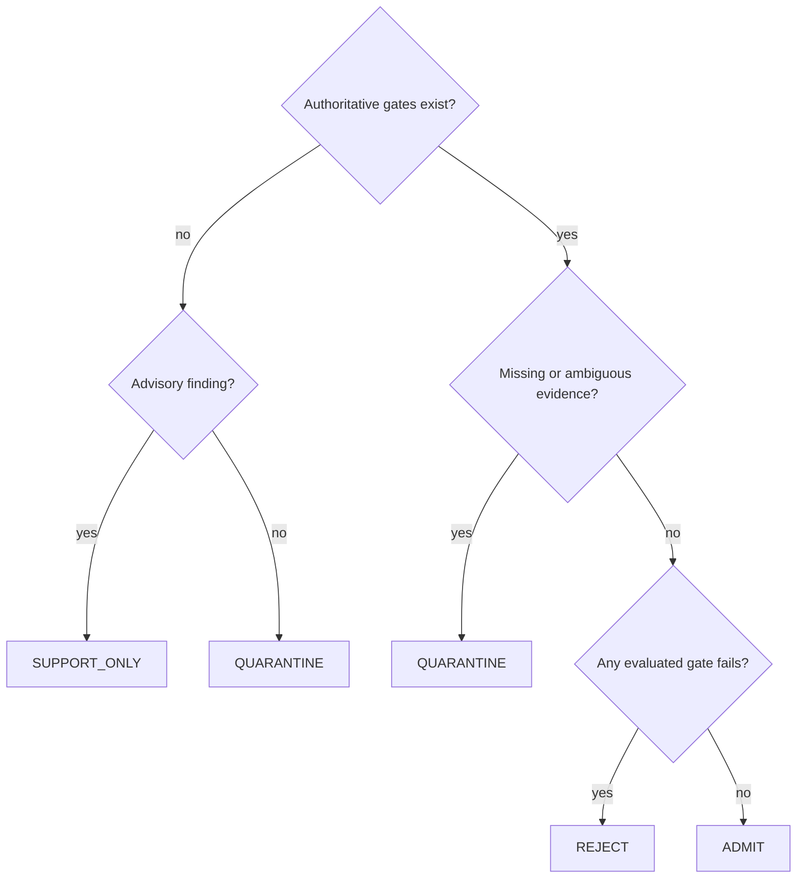
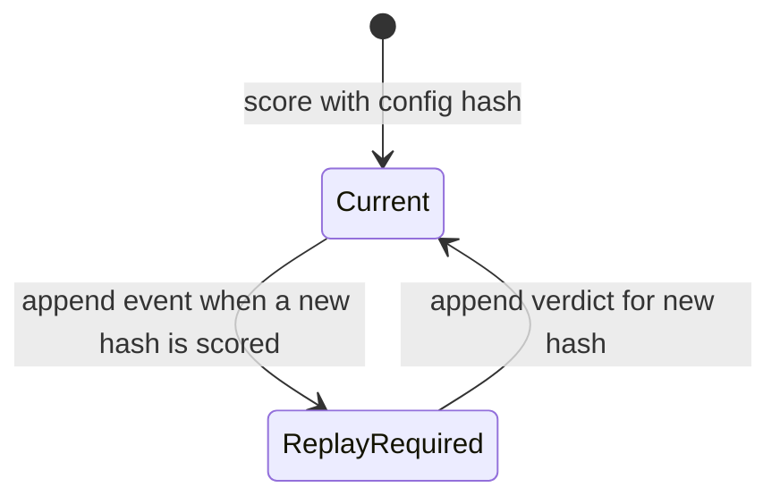

# Unified Public Detrix - Plan

## Goal Capsule

- **Objective:** Ship an installable, offline-demonstrable Python CLI that turns documented agent-trace failures into deterministic post-hoc Langfuse admission verdicts.
- **Authority:** The user specification and privacy fences override source-repository implementation details; only the named publicizable contracts may shape the new code.
- **Execution profile:** Build behavior with integration-style tests, commit each coherent unit on `main`, and never write outside this repository or `/tmp`.
- **Stop conditions:** Stop only when sync, tests, lint, demo, source-size, SDK-version, and independent review evidence pass, or when a privacy/authority blocker cannot be resolved conservatively.
- **Tail ownership:** Ralph owns review, deslop, regression verification, local commits, and exact final reporting; no push or remote publication occurs.

---

## Product Contract

### Summary

Build the complete requested public package: config initialization, local trace collection, deterministic-first scoring, typed fail-closed admission, idempotent score pushback, reporting, and a no-network demo.

### Problem Frame

Teams can document recurring agent failures and observe traces in Langfuse, but they lack a small reproducible bridge from those failure descriptions to auditable post-hoc admission decisions.
The package must make authoritative decisions only from deterministic or structural evidence, remain useful without an LLM, and expose uncertainty instead of silently accepting it.

### Requirements

#### Package and configuration

- R1. A stranger can install the package with `uv`, run `detrix demo` without keys or network, and reproduce the documented three-trace outcome.
- R2. `detrix init` supports only the specified YAML schema and exact Markdown audit-table schema, produces deterministic gate configuration, and warns that advisory gates are non-authoritative.
- R2a. The canonical YAML root is `failures`; each item has `id`, `description`, `severity` (`high|medium|low`), and `detection`. Detection is exactly `deterministic|structural|advisory`; the closed rule set is `present_pattern`, `absent_pattern`, `json_field_range`, `json_field_required`, and `observation_error_unhandled`. Addressable fields are exactly `trace.input`, `trace.output`, `trace.metadata.X`, and `observations[*].input|output|name|level|metadata.X`.
- R2b. The Markdown header is exactly `Pattern | Mechanism | Project-goal impact | Evidence traces | Next gate/check`; output ids slugify Pattern, descriptions use Mechanism, and advisory prompts use Next gate/check.
- R3. Configuration contains environment-variable names but no credentials, and its semantic content has a stable full SHA-256 hash.

#### Scoring and admission

- R4. The gate contract retains `GovernanceGate`, `VerdictContract`, `Decision`, `GateIdentity`, `GateContext`, and `DomainEvaluator` with a minimal public implementation.
- R5. The engine implements exactly the five requested deterministic rule kinds and only the documented jsonpath-lite fields.
- R6. Deterministic and structural failures may reject; missing evidence, malformed or unjoinable inputs, gate errors, and ambiguous results quarantine with typed reason codes.
- R7. Advisory gates produce support-only evidence and never change an authoritative verdict; no Anthropic dependency or call is present.
- R7a. `SUPPORT_ONLY` means the config contains no authoritative gates: report and push count it as a distinct categorical verdict, and the CLI tells the operator to harden advisory stubs before treating them as admission evidence.
- R8. Every trace score produces a typed `AdmissionPacket` containing trace identity, config hash, gate results, final decision, evidence pointers, and typed reasons.

#### Persistence and Langfuse

- R9. SQLite stores raw trace packets, verdicts, pushes, and append-only schema-versioned events; config changes append stale/replay-required events without rewriting old verdicts.
- R10. `detrix pull` uses the installed supported Langfuse SDK public API to retrieve filtered traces and full observations, then idempotently upserts raw JSON.
- R11. `detrix push` writes one categorical verdict score plus one numeric score per authoritative gate, records returned identifiers, and skips a trace/config score set already pushed.
- R12. Explicit network commands fail loudly with missing-variable, HTTP, or SDK errors; injected fake clients remain the integration-test boundary.
- R12a. Secret values and raw response bodies are never persisted in configuration, push comments, events, or rendered boundary errors; tests use sentinel credentials to prove redaction.

#### Reporting and quality

- R13. `detrix report` shows verdict counts, per-failure-mode hit rates, and top offending trace identifiers.
- R14. Required integration-style coverage exercises every rule pass/fail, Markdown conversion, fail-closed behavior, advisory non-authority, staleness, push idempotency, and the CLI demo.
- R15. `uv sync`, pytest, Ruff at line length 100, and the exact README quickstart all pass with source kept near or below 2,500 lines.

### Acceptance Examples

- AE1. Given the clean bundled trace and example failures, when `detrix demo` runs offline, then it prints ADMIT with no authoritative failure reason.
- AE2. Given a completion claim with no recorded test command, when the deterministic absent-pattern gate runs, then it prints REJECT with the gate-hit reason.
- AE3. Given a trace missing evidence required by an authoritative gate, when scoring runs, then it prints QUARANTINE with a missing-evidence reason.
- AE4. Given an advisory gate that flags a concern while deterministic gates pass, when scoring runs, then the admission stays ADMIT and advisory evidence is separately visible.
- AE5. Given an old verdict and a changed semantic gate config, when scoring resumes, then an append-only stale/replay-required event exists and the old verdict remains immutable.
- AE6. Given scores already pushed for the same trace and config hash, when `detrix push` runs again, then no duplicate SDK score calls occur.
- AE7. Given an advisory-only Markdown conversion, when it is scored, reported, and pushed, then the categorical result is SUPPORT_ONLY and the output says deterministic hardening is required.
- AE8. Given an injected Langfuse boundary and named environment variables, the first-value `init -> pull -> score -> report -> push` journey persists full observations, renders a report, and records returned score identifiers without network mocks inside application modules.

### Scope Boundaries

- Post-hoc evaluation only; no action wrapping, runtime blocking, agent constraints, or claims that gates block agent actions.
- No DAG/pipeline engine, training exporter, promoter, bridge/web app, extension, XRD gates, benchmark content, sealed-label system, or private runtime compatibility hacks.
- No extra rule DSL, external jsonpath package, web framework, database framework, or non-OpenAI LLM provider.
- No private documentation, history, customer material, metrics, credentials, host paths, run artifacts, or model identities enter the repository.

---

## Planning Contract

### Key Technical Decisions

- KTD1. Use strict canonical JSON and full SHA-256 for trace/config provenance; unsupported non-JSON values are validation errors, not stringified silently.
- KTD2. All authoritative gates must pass for ADMIT; an evaluated gate failure produces REJECT, while evidence/config/evaluator uncertainty produces QUARANTINE.
- KTD3. Keep advisory results outside the authoritative reducer; SUPPORT_ONLY is reserved for traces with advisory findings when no authoritative gate exists, while deterministic passes plus advisory findings remain ADMIT.
- KTD4. Store raw trace packets and append-only version events in one stdlib SQLite database; immutable verdict rows are superseded by one `REPLAY_REQUIRED` event naming old and new config hashes plus fresh rescoring, never updates. Create `.detrix` with mode 0700 and the database with mode 0600.
- KTD5. Put SDK compatibility in `langfuse_io.py` and inject the client at that boundary; application modules never depend on private SDK members.
- KTD6. Prefer the minimum gate/config models needed for the public story and omit training, reward, replay, promotion, and sealed-label fields.

### Assumptions

- The installed Langfuse major version exposes public client access for trace listing, trace retrieval or observations listing, and score creation; exact method shapes are implementation-time facts to inspect before coding the adapter.
- A trace packet is joinable when it has a trace identifier and an observations list whose entries belong to that trace; absent or inconsistent ownership quarantines.
- `SUPPORT_ONLY` applies only when a configuration has no authoritative gates and advisory output exists; it is never a fallback for deterministic ambiguity.
- SQLite is single-process enough for this local CLI; standard transactions provide the required idempotency without distributed locking.

### High-Level Technical Design







### Sequencing

Define public types and gate semantics first, then parsers and persistence, then the engine, then the inspected SDK adapter, and finally the composed CLI/documentation surface.
Each behavior-bearing unit begins with focused failing or characterization coverage and ends with a coherent local commit.

---

## Output Structure

```text
LICENSE
README.md
implementation-notes.md
pyproject.toml
uv.lock
src/detrix/
  __init__.py
  admission.py
  gates.py
  failures.py
  store.py
  engine.py
  langfuse_io.py
  cli.py
examples/
  failures.example.yaml
  sample_traces/
tests/
```

---

## Implementation Units

### U1. Package scaffold and typed governance core

- **Goal:** Establish installable package metadata plus minimal public admission and gate contracts.
- **Requirements:** R1, R4, R6, R7, R8, R15; KTD1, KTD2, KTD3, KTD6.
- **Dependencies:** None.
- **Files:** `pyproject.toml`, `LICENSE`, `implementation-notes.md`, `src/detrix/__init__.py`, `src/detrix/admission.py`, `src/detrix/gates.py`, `tests/test_gates.py`.
- **Approach:** Use Pydantic v2 frozen/validated models and string enums; keep one gate ABC plus the requested evaluator protocol and concrete closed-set rule dispatch.
- **Execution note:** Start with rule-result and reducer tests, including every deterministic rule pass/fail and quarantine paths.
- **Patterns to follow:** Typed verdict contracts, stable gate identities from semantic config, exactly-one deterministic interpretation, and strict canonical serialization.
- **Test scenarios:** All five rule kinds pass and fail; missing addressed data quarantines; invalid regex/range config fails validation; advisory results cannot alter authoritative reduction.
- **Verification:** Focused gate tests pass and exported types import from the installed package.

### U2. Failure-document parsing and initialization

- **Goal:** Convert canonical YAML or the exact audit table into validated failure configs and starter files.
- **Requirements:** R2, R3, R15.
- **Dependencies:** U1.
- **Files:** `src/detrix/failures.py`, `tests/test_failures.py`, `examples/failures.example.yaml`.
- **Approach:** Parse the limited YAML subset through the installed Langfuse dependency tree's YAML support only if publicly available; otherwise add the light PyYAML dependency only because canonical YAML is a required input contract. Validate closed detection/rule enums and write deterministic YAML.
- **Execution note:** Begin with parser tests for canonical YAML, exact Markdown conversion, malformed tables, slug collisions, and advisory warning text.
- **Patterns to follow:** Closed schemas and loud errors with actionable file/row context.
- **Test scenarios:** Canonical YAML round-trips; exact table converts to stubs; wrong columns fail; no-input init writes both files; generated configs contain env names but no secrets.
- **Verification:** Parser integration tests validate emitted files by reading them back through the same public loader.

### U3. SQLite history, scoring engine, and reports

- **Goal:** Persist raw traces, immutable verdicts, and durable push receipts; detect config supersession, score stored traces, and aggregate reports.
- **Requirements:** R3, R5, R6, R8, R9, R13, R14; AE1-AE5; KTD1-KTD4.
- **Dependencies:** U1, U2.
- **Files:** `src/detrix/store.py`, `src/detrix/engine.py`, `tests/test_engine.py`, `tests/test_store.py`.
- **Approach:** Use explicit schema creation and transactions, restrictive local file permissions, append events carrying their own schema version, content-hash-aware verdict uniqueness, report SQL over current verdicts, and push receipts keyed by trace/config/score name with returned SDK identifiers. U4 consumes this store API.
- **Execution note:** Prove staleness with a regression test that scores, edits semantic config, rescans, and asserts old verdict immutability plus a replay-required event.
- **Patterns to follow:** Append-only promote/invalidate semantics, typed reason codes, per-event schema dispatch, and deterministic closure.
- **Test scenarios:** Idempotent raw upsert; restrictive path permissions; clean/reject/quarantine scoring; old verdict becomes replay-required after config edit; duplicate score for unchanged hash is skipped across separate store/client instances; report counts/hit rates/offenders are stable.
- **Verification:** Store and engine tests pass against temporary real SQLite databases without internal mocks.

### U4. Langfuse pull and score-push adapter

- **Goal:** Integrate the actual installed Langfuse major version for direct trace collection and idempotent score creation.
- **Requirements:** R10, R11, R12, R14; AE6; KTD5.
- **Dependencies:** U3 and inspected SDK installation.
- **Files:** `src/detrix/langfuse_io.py`, `tests/test_langfuse_io.py`, `pyproject.toml`, `uv.lock`.
- **Approach:** Install and inspect the SDK before implementation, pin its supported major range, isolate public API calls behind one injectable boundary, normalize SDK models to strict JSON, and translate SDK/HTTP failures into actionable redacted CLI errors. Bound canonical input documents, regex length, observations per trace, and serialized packet size before persistence.
- **Execution note:** Capture installed version and signatures first; then write boundary tests with an injected recording fake client before adapter implementation.
- **Patterns to follow:** Required explicit commands fail loudly; fake clients record exact calls and returned score identifiers; no private SDK attributes.
- **Test scenarios:** Missing env names identify the variable; filtered pull includes full observations; pagination/limit is honored; malformed/unjoinable packets quarantine; score names/values/comments are exact; same trace/config push is skipped; partial failure remains retryable.
- **Verification:** Boundary tests pass with the fake client and a smoke import confirms only public installed SDK members are referenced.

### U5. CLI, offline demo, documentation, and full proof

- **Goal:** Compose all commands, bundled samples, quickstart documentation, and final quality evidence.
- **Requirements:** R1-R15; AE1-AE6.
- **Dependencies:** U1-U4.
- **Files:** `src/detrix/cli.py`, `examples/sample_traces/clean.json`, `examples/sample_traces/reject.json`, `examples/sample_traces/quarantine.json`, `tests/test_cli.py`, `README.md`, `implementation-notes.md`.
- **Approach:** Keep Click commands thin over public modules, resolve bundled examples from the installed package/repository safely, print deterministic human-readable summaries, and document post-hoc/advisory semantics precisely.
- **Execution note:** Start with the `CliRunner` demo contract, then exercise init/score/report flows through real files and SQLite.
- **Patterns to follow:** Command-first 15-minute proof, loud boundary errors, and no claims that gates block actions.
- **Test scenarios:** Demo prints the three required verdicts/reasons; init modes create correct files; pull/push option plumbing reaches the fake boundary; report output contains requested aggregates; README commands run exactly as written.
- **Verification:** Fresh sync, full pytest, Ruff, source-line count, privacy scan, demo output, and independent architecture/correctness review all pass.

---

## Risks and Dependencies

- Langfuse public APIs may differ materially by major version; only the inspected installed version is supported and the adapter stays isolated.
- Langfuse trace list responses may omit full observations; the adapter must explicitly fetch or list them and fail closed when they cannot be joined.
- YAML parsing is not available in the Python standard library; PyYAML is acceptable only if required after inspecting the installed dependency graph, and the deviation must be logged.
- SQLite schema evolution is intentionally limited to v1 creation; unknown event schema versions fail closed instead of being guessed.

---

## Verification Contract

| Gate | Evidence | Applies to |
|---|---|---|
| Dependency resolution | `uv sync` exits zero from a clean lock | U1-U5 |
| Tests | `uv run pytest -q` exits zero with the summary retained | U1-U5 |
| Lint | `uv run ruff check .` reports no errors at line length 100 | U1-U5 |
| Demo | `uv run detrix demo` prints clean ADMIT, planted REJECT, and missing-evidence QUARANTINE | U5 |
| Packaging | `uv run detrix --help` and imports succeed from the synced environment | U1, U5 |
| Size | `find src/detrix -name '*.py' -print0 | xargs -0 wc -l` totals at most 2,500 lines | U5 |
| Local confidentiality | `.detrix` is mode 0700, `store.db` is mode 0600, and sentinel secrets do not appear in persisted or rendered output | U3, U4 |
| Privacy | Repository search finds no forbidden private paths, benchmark/customer names, credentials, model names, or copied history | U1-U5 |
| Langfuse | Installed version and exact public pull/push calls are recorded in implementation notes and final output | U4 |
| Independent review | Architect/correctness review approves the implemented scope after fixes | U1-U5 |

---

## Definition of Done

- Every requirement and acceptance example is implemented and covered by runnable evidence.
- All five units are complete with coherent conventional/Lore commits on local `main`; no remote push occurs.
- The exact quality-gate commands and README quickstart succeed in the final tree.
- `implementation-notes.md` contains a Deviations heading with every deviation or an explicit none entry.
- No abandoned attempts, dead abstractions, private artifacts, generated credentials, or untracked implementation files remain.
- Ralph's architect review, changed-file deslop pass, and post-deslop regression verification pass.
